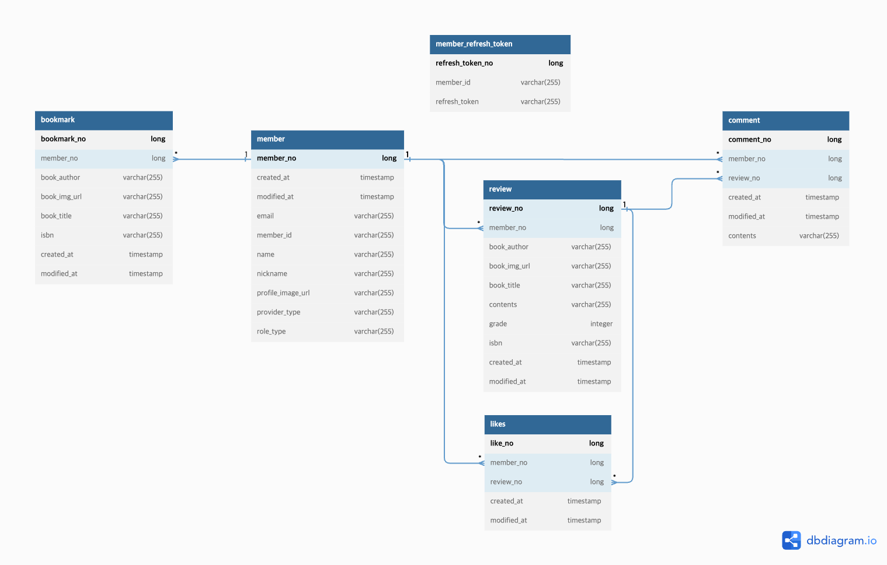

# Look-Book-Backend

 

## 핵심 기능 소개
1. **스프링 시큐리티를 활용한 Oauth2 소셜 로그인** 
2. **open API를 활용한 다양한 인기 도서 추천 시스템**
3. **리뷰, 댓글, 좋아요 도서관련 커뮤니티 제공**
4. **도서 관련 상세 정보와 북마크 기능**

자세한 기능들은 [API명세서](https://scarlet0o0s-organization.gitbook.io/api) 참고

 

## 기술 스택
- Spring Boot
- Spring Data JPA
- Spring Security
- Mysql
- AWS EC2
- AWS CodeDepoly
- AWS S3
- AWS RDS
- Nginx

 

## 서버 아키텍쳐

 

## 데이터베이스 설계

 

## 트러블 슈팅
